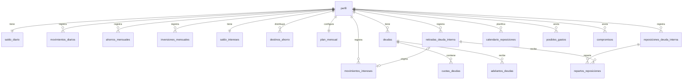

# Base de datos

Zentro utiliza **SQLite relacional** en `Zentro.Api/Data/zentro.db`. Las tablas y columnas están en español. Cada dato tiene su columna, tipo y restricciones; no hay columnas `payload`, `document` ni registros JSON. No hace falta instalar un servidor MySQL.

El [esquema SQL](../Zentro.Api/Infrastructure/Persistence/Schema/001_relacional.sql) y sus migraciones definen las 19 tablas, sus claves, restricciones, índices y vistas. Se incluye en el ensamblado de la API, también al publicar. `PRAGMA user_version` identifica la versión de estructura; es independiente de la versión del contrato HTTP.

La versión de estructura actual es **5**. La [migración 002](../Zentro.Api/Infrastructure/Persistence/Schema/002_previsiones_sin_mes.sql) elimina `mes` de `movimientos_diarios`: las previsiones diarias no caducan al cambiar de mes. Se conserva cada registro y su importe. La API crea un respaldo privado antes de actualizar una base de versión 1. Los historiales de ahorro, inversión y cuotas siguen teniendo meses.

Los adelantos se guardan en `adelantos_deudas`: deuda, fecha, importe en céntimos y estrategia (`cuotas` o `importe`), con claves foráneas. La migración 004 añade la tabla y la 005 incluye estos pagos en `vista_deudas`, sin duplicar cuotas. Ambas conservan los datos existentes y crean un respaldo antes de actualizar.

## Consultar desde VS Code

Abre `Zentro.Api/Data/zentro.db` con **SQLite Viewer** (extensión recomendada). Si lo tienes abierto desde antes de la migración, vuelve a abrirlo o recarga el visor. Selecciona una tabla para ver sus columnas y registros. Las vistas `vista_resumen`, `vista_ahorros_mensuales`, `vista_inversiones_mensuales`, `vista_deudas` y `vista_deuda_interna` presentan los importes en euros y los saldos calculados.

Ejemplo de consulta en un editor SQLite que permita ejecutar SQL:

```sql
SELECT * FROM vista_resumen;
SELECT mes, objetivo_euros, aportado_euros, neto_euros, previsto_euros
FROM vista_ahorros_mensuales
ORDER BY mes DESC;
SELECT nombre, total_euros, pagado_euros, apartado_euros, restante_euros
FROM vista_deudas;
```

Usa la aplicación para modificar los datos: además de las restricciones SQL, la API verifica que pagos, retiradas, calendarios y saldos sean coherentes entre sí.

## Tablas

| Tabla                        | Contenido y columnas principales                                                                                                                                   |
| ---------------------------- | ------------------------------------------------------------------------------------------------------------------------------------------------------------------ |
| `perfil`                     | Perfil local único, `version`, `efectivo_centimos`, `oferta_hipoteca_centimos`, `actualizado_el`.                                                                  |
| `saldo_diario`               | `saldo_inicial_centimos` y `fecha_saldo`; punto de partida del día a día.                                                                                          |
| `movimientos_diarios`        | `tipo` (`gasto`/`ingreso`), `concepto`, `importe_centimos`, `estado` (`previsto`/`realizado`), `incluido_en_saldo_inicial`.                                        |
| `ahorros_mensuales`          | `mes`, `objetivo_centimos`, `aportacion_centimos`, `repuesto_centimos`, `retirado_centimos`, `aproximado_centimos`.                                                |
| `inversiones_mensuales`      | `mes`, `objetivo_centimos`, `aportacion_centimos`, `aproximado_centimos`.                                                                                          |
| `saldo_intereses`            | Saldo inicial de intereses y fecha.                                                                                                                                |
| `movimientos_intereses`      | `fecha`, `concepto`, `importe_centimos`; las retiradas negativas enlazan con `retirada_id`.                                                                        |
| `destinos_ahorro`            | `nombre`, `tipo`, `capital_centimos`, `interes_anual_puntos_basicos`, `tipo_interes`, `metodo_calculo`, `retencion_puntos_basicos`, `fecha_inicio`, `plazo_meses`. |
| `retiradas_deuda_interna`    | `fecha`, `concepto`, `importe_centimos`, `origen` (`ahorro`/`intereses`), `historica`.                                                                             |
| `reposiciones_deuda_interna` | `fecha`, `importe_centimos`, `historica`.                                                                                                                          |
| `repartos_reposiciones`      | `reposicion_id`, `retirada_id`, `importe_centimos`; indica qué retirada repone cada pago.                                                                          |
| `calendario_reposiciones`    | `mes` e `importe_centimos` previsto.                                                                                                                               |
| `deudas`                     | `nombre` y `total_centimos` de cada deuda externa.                                                                                                                 |
| `cuotas_deudas`              | `deuda_id`, `mes`, `importe_centimos`, `estado` (`pagado`/`apartado`/`pendiente`).                                                                                 |
| `adelantos_deudas`           | `deuda_id`, `fecha`, `importe_centimos`, `estrategia` (`cuotas`/`importe`); pagos anticipados aceptados.                                                           |
| `plan_mensual`               | `mes_inicio`, `mes_final`, importes previstos de ahorro, inversión y reposición, y objetivo de ahorro.                                                             |
| `posibles_gastos`            | `concepto` e `importe_centimos`; independiente de meses y cuentas.                                                                                                 |
| `compromisos`                | `nombre` e `importe_centimos` opcional.                                                                                                                            |

Todas las tablas dependen de `perfil`. Las colecciones tienen `orden` para conservar el orden elegido en la aplicación. Los meses son únicos dentro de su historial; las cuotas son únicas por deuda y mes.



## Tipos y reglas

- Importes: `INTEGER` en céntimos para evitar errores de coma flotante. Las vistas dividen por 100 para consultar en euros.
- Tipos de interés y retención: puntos básicos, donde 100 representa un 1 %.
- Fechas: `TEXT` en formato `AAAA-MM-DD`; meses: `AAAA-MM`. Los valores se validan en SQL y en la API.
- Booleanos: 0 o 1; estados: valores españoles limitados mediante `CHECK`.
- `aportacion_centimos = NULL` significa sin registrar. Cero es una aportación registrada de cero; las aportaciones negativas se conservan.
- `capital_centimos = NULL` asigna automáticamente el ahorro restante a una cuenta remunerada. Solo se permite un destino automático por perfil.
- `historica = 1` identifica retiradas o reposiciones ya incluidas en el saldo importado; no se contabilizan otra vez.
- Las cuotas apartadas siguen dentro del importe por pagar. Patrimonio excluye efectivo, saldo diario y oferta hipotecaria.

Las tablas son `STRICT`, las claves foráneas están activadas en cada conexión y las escrituras se realizan en una transacción. Un fallo revierte el guardado completo. Los modelos .NET se traducen explícitamente a columnas mediante `Infrastructure/Persistence/Stores/`; los controladores no contienen SQL.

## Migración y privacidad

Al abrir una base de la versión anterior, la API:

1. Crea una copia coherente con la función nativa de respaldo SQLite, incluidos los datos pendientes del WAL.
2. Lee y valida los registros antiguos.
3. Crea las tablas relacionales y escribe sus columnas dentro de una transacción.
4. Relee los datos y comprueba que coincidan con el perfil original.
5. Elimina las tablas antiguas y confirma la nueva versión de estructura.

Si falla cualquier comprobación, la transacción se revierte. La base original y la copia privada se conservan. Un segundo arranque no vuelve a migrar ni genera otra copia.

Las copias están en `%LOCALAPPDATA%\Zentro\backups`, fuera del repositorio. `Zentro__DatabasePath` permite cambiar la ubicación de la base y `Zentro__BackupDirectory` la de los respaldos. No copies una base activa ignorando sus auxiliares; usa el respaldo nativo o cierra la aplicación primero.

Git comparte el esquema y las migraciones, **nunca los datos**: `.gitignore` excluye `.db`, auxiliares SQLite, respaldos y exportaciones. El JSON permanece como formato de intercambio HTTP y de exportación/importación de la interfaz; no se almacena dentro de columnas.

La [migración 003](../Zentro.Api/Infrastructure/Persistence/Schema/003_gestion_deudas.sql) añade fechas de creación, cierre y archivo, notas e historial a las deudas existentes. El historial se guarda en la tabla relacional `historial_deudas`, con `deuda_id`, `fecha`, `descripcion` y orden, sin JSON. Las cuotas e importes anteriores permanecen intactos. El cierre exige que el total esté pagado. El archivo conserva los datos y los excluye de las deudas activas y del calendario financiero.
